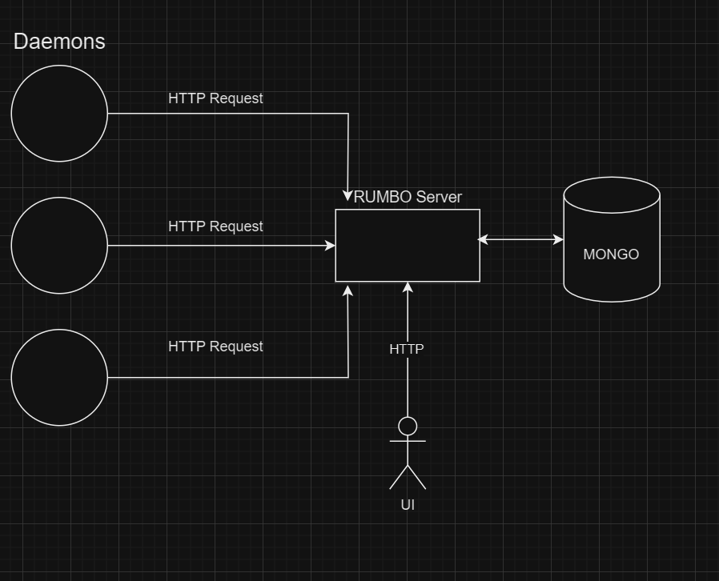

Rust Monitoring Board(Rumbo) - is a dashboard for collecting metrics like a server info(CPU, RAM, health checks etc.), logs, and error aggregation.

## Architecture


# Models
## General metric info
```JSON
{
    "instance_name":"INSTANCE_ID",
    "timestamp":"CREATING_DATE",

    "metric_value":{}
}
```
## Metric types
```JSON
[
    {
        "metric_type":"RamSpace",
        "free_amount": 0,
        "total_amount": 0
    },
    {
        "metric_type":"CpuUsage",
        "core":"1",
        "load_percents": 120
    },
    {
        "metric_type":"DiskUsage",
        "name":"Disk1",
        "load_percents": 120,
        "reading_speed": 2000,
        "writing_speed": 2000
    },
    {
        "metric_type":"NetworkUsage",
        "sending_speed":100,
        "receiving_speed":100,
        "name": "some_adapter"
    },
    {
        "metric_type":"DiskSpace",
        "name":"Disk1",
        "free_amount":0,
        "total_amount":0
    }
]
```

# Development Info
## Project overview
### rumbo_ui
    Angular frontend part
### rumbo_web
    Binary file. It will contains only configuration of the web server. It should be as less as possible
### rumbo_logic
    This project will contain all business logic for our project.

The profit of this separation that rumbo_logic could be covered fully by tests and by default rust lib projects contains test samples.

## Keeping GIT history
In case of moving or renaming files is better to keep the history of previous changes in this section you could find a guide how to do it.


## Commands for docker
Commands for Dockerfile:
 - docker run --name rumbo -p 8080:8080 -it rumbo
 - docker build . -t rumbo

Commands for Docker Compose:
 - docker-compose build
 - docker-compose up
